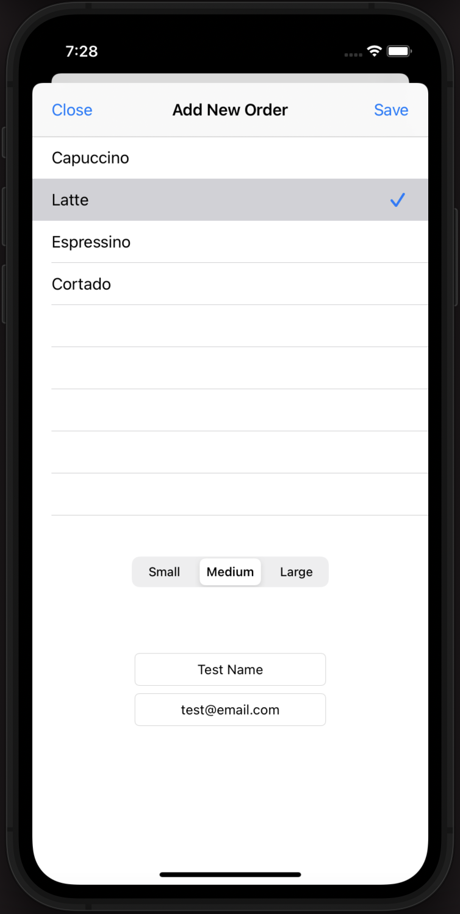
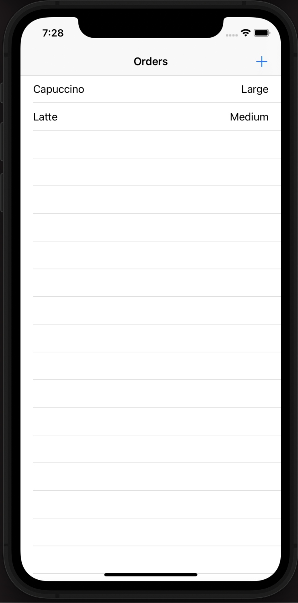

# CoffeeOrder

## Swift iOS coffee ordering app that uses the MVVM design pattern that makes "GET" and "POST" requests to an API for the orders

## Screenshots

| Add New Order Screen | Order Screen | 
| --------------------------  | --------------- | 
 |  |  

